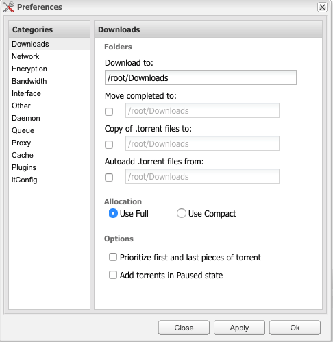
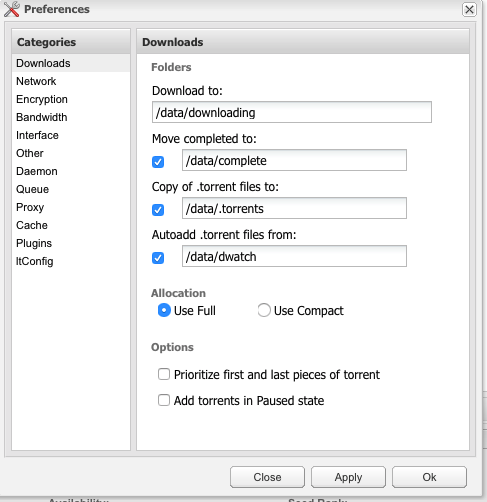

# Deluge

 

> This container runs the Deluge BitTorrent daemon and the web ui. To learn more, visit the [Deluge website](http://deluge-torrent.org).

General Information
=============

Deluge is accessible via:  
- http://YOUR.IP.ADDR.ESS/deluge  
- http://YOUR.IP.ADDR.ESS:8112  

Available variables:
--------

- `TZ`: Your timezone. Default: **America/Denver**
- `PUID`: User UID. Default: **1000**
- `PGID`: User group id. Default: **1000**

Configuring the directories
============

After starting Deluge for the first time, you must configure the directories for torrents.

  

Make the following changes to the directories

  

Adding ltConfig
=======

Download the egg from [Github](https://github.com/ratanakvlun/deluge-ltconfig/releases/download/v0.2.5.0/ltConfig-0.2.5.0-py2.7.egg).

In the Deluge Web UI go to preferences --> plugins and click add. Select the ltconfig.egg file you just downloaded.
