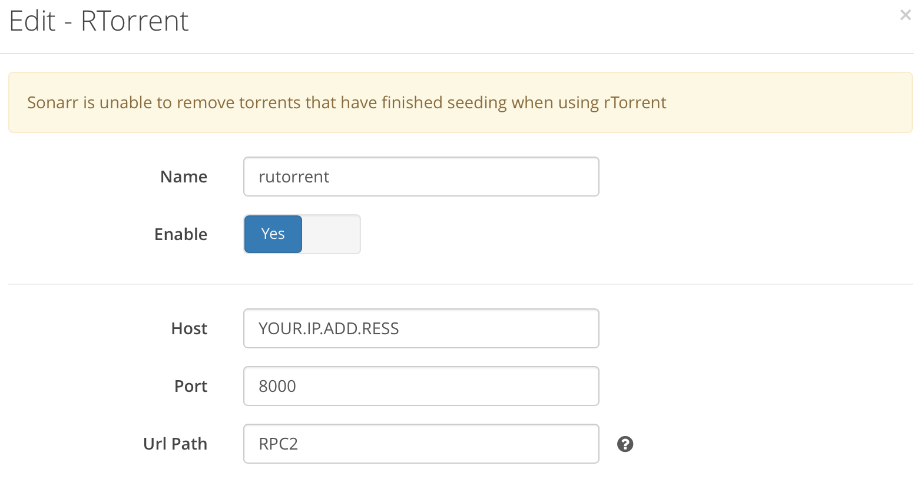
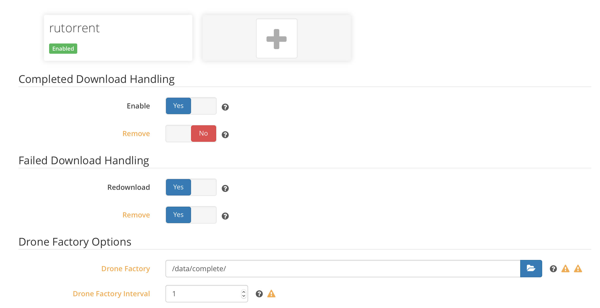

# Sonarr

> The Sonarr container runs on Ubuntu 16.04 via Mono

Sonarr is accessible via http://YOUR.IP.ADDR.ESS:8989

**Available variables:**

- `TZ`: Your timezone. Default: **America/Denver**
- `PUID`: User UID. Default: **1000**
- `PGID`: User group id. Default: **1000**

**Volumes:**

- `./config/sonarr:/config`: Where the config files are stored.
- `./data:/data`: Entire directory of all files. Used to mount the complete folder.
- `./data/downloading:/downloads`: Where downloading torrents are located
- `./media/TV Shows:/tv`: Location of media directory, where Plex reads from. Sonarr hardlinks complete files here.

Setting up Sonarr to automatically use rTorrent to download files and automatically
hardlink them to the organized media folder is easy.

1.Visit the Sonarr web interface.
2.Go to `Download Client` and click add.
3.Choose rTorrent and enter the settings shown in the screenshot.

4.On the `Download Client` page, toward the bottom is the Drone configuration. Point the drone to watch `/data/complete`.

